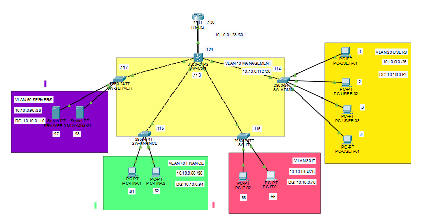

# CyberTech Enterprise LAN Network Design

## Project Overview

This project demonstrates the design and implementation of a segmented enterprise Local Area Network (LAN) using Cisco Packet Tracer.

The objective of this project was to design a scalable network infrastructure based on enterprise networking principles, including VLAN segmentation, IPv4 addressing, Layer 3 switching, and inter-VLAN routing.

The network was designed for a fictional company, CyberTech Solutions, with separate departments, management infrastructure, and dedicated server resources.

---

## Design Decisions

### VLAN Segmentation

Each department was separated into its own VLAN to improve network organization, reduce broadcast traffic, and prepare the network for future security policies.

### Layer 3 Switching

A Layer 3 core switch was selected to perform inter-VLAN routing using SVIs instead of router-on-a-stick architecture.

### Management Network

A dedicated Management VLAN was created for administration of network devices.

### VLSM Addressing

VLSM was implemented to optimize IPv4 address allocation and allow future network expansion.

### Server Segmentation

Servers were placed in a separate VLAN to isolate critical infrastructure from user networks.

--- 

## Network Architecture

The network follows a hierarchical LAN design:

- **Router** - provides connectivity to external networks
- **Layer 3 Core Switch** - provides inter-VLAN routing using Switch Virtual Interfaces (SVIs)
- **Access Switches** - connect end-user devices
- **Server Network** - provides dedicated infrastructure services

---
  
## Topology

---

## Technologies Used

- Cisco Packet Tracer
- Cisco IOS
- VLANs
- VLAN Trunking (802.1Q)
- Layer 2 Switching
- Layer 3 Switching
- Switch Virtual Interfaces (SVIs)
- Inter-VLAN Routing
- IPv4 Addressing
- VLSM (Variable Length Subnet Masking)
- Static Routing

---

## VLAN Design

| VLAN | Name | Purpose |
|------|------|---------|
| 10 | Management | Network device administration |
| 20 | Users | Employee workstations |
| 30 | IT | IT department devices |
| 40 | Finance | Finance department devices |
| 50 | Servers | Server infrastructure |

---

## Core Switch - Router Connection

A dedicated point-to-point subnet was created between the Layer 3 core switch and the router.

| Device | Interface | IP Address |
|--------|-----------|------------|
| Core Switch | Gi0/1 | 10.10.0.129/30 |
| Router | Gi0/0 | 10.10.0.130/30 |

This connection provides routing between the internal LAN and external networks.

---

## IP Addressing Plan

The network uses VLSM to efficiently allocate IPv4 address space.

| VLAN | Network | Default Gateway |
|------|---------|-----------------|
| 10 | 10.10.0.112/28 |  |
| 20 | 10.10.0.0/26 | 10.10.0.62 |
| 30 | 10.10.0.64/28 | 10.10.0.78 |
| 40 | 10.10.0.80/28 | 10.10.0.94 |
| 50 | 10.10.0.96/28 | 10.10.0.110 |

---

## Implemented Features

- [x] Network topology design
- [x] VLAN creation and segmentation
- [x] VLAN naming and organization
- [x] Access port configuration
- [x] Trunk links between switches
- [x] Allowed VLAN configuration on trunk links
- [x] Switch Virtual Interfaces (SVIs)
- [x] Inter-VLAN routing on Layer 3 switch
- [x] Management IP addressing for access switches
- [x] VLSM-based IPv4 addressing
- [x] Static routing configuration
- [x] Network connectivity testing

The following Cisco IOS commands were used to verify the network configuration.

---

## Network Testing

The following connectivity tests were performed:

- Communication between devices in the same VLAN
- Communication between different VLANs
- Access switch management connectivity
- Core switch connectivity to the router
- Verification of routing between internal networks

---

## Future Improvements

Planned improvements for future versions:

- [ ] SSH secure device management
- [ ] DHCP implementation
- [ ] Access Control Lists (ACLs)
- [ ] Wireless network deployment
- [ ] Guest Wi-Fi segmentation
- [ ] Dynamic routing using OSPF
- [ ] Network monitoring and logging

## Full project documentation:

[Documentation](Documentation/Enterprise-LAN-Design.pdf)

[Packet Tracer](Packet-Tracer/CyberTech-Network.pkt)

## Author

Kristýna Saláková
